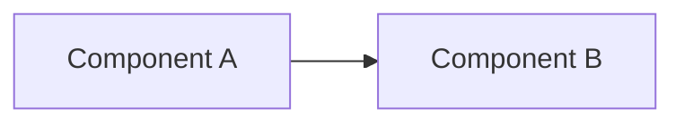

# spec-driven development 統合ワークフロー

現在の状況を自動判定し、適切なフェーズから開発を開始・継続する。

# 状況判定

まず以下の情報を収集し、現在のフェーズを判定せよ：

1. `git branch --show-current` で現在のブランチ名を取得
2. ブランチ名からslugを抽出（slash以降。例: `feat/create-article-component` → `create-article-component`）
3. `.spec/{slug}/spec.html` および `.spec/{slug}/spec.md` の存在確認（どちらの形式で書かれているかも併せて把握する）
4. specファイルが存在する場合、タスクの進捗状況を確認する
   - HTML形式（`spec.html`）: `class="task done"` / `class="task todo"`
   - Markdown形式（`spec.md`）: `- [x]`（完了） / `- [ ]`（未完了）

## フェーズ判定ルール

| 条件 | フェーズ |
|------|---------|
| main/masterブランチにいる & specなし | **Phase 1: 計画開始** |
| feature branchにいる & specなし | **Phase 1: 計画開始**（ブランチは既存を使う） |
| feature branchにいる & specあり & タスク未着手 | **Phase 2: 実装開始** |
| feature branchにいる & specあり & タスク一部完了 | **Phase 3: 実装再開** |
| feature branchにいる & specあり & タスク全完了 | **Phase 4: 仕上げ** |

判定結果をユーザーに伝えてから、該当フェーズの作業を開始せよ。

> **⚠️ 絶対ルール: specファイルが存在しない場合、Phase 1（計画開始）以外のフェーズに進んではならない。どんな場合でも、まず spec を作成し、ユーザーの承認を得ること。Auto modeであっても、spec承認前に実装を開始することは禁止。**

---

# Phase 1: 計画開始

ユーザーから実行したいタスクの概要を聞き、spec作成から始める。

## ブランチ準備
- タスク概要から適切なslugを考える（例：「記事コンポーネントを作成する」→ `create-article-component`）
- main/masterにいる場合：
  - remoteからpullして同期
  - `git checkout -b {type}/{slug}` でブランチ作成
  - `type` は `feat`, `fix`, `refactor`, `perf`, `style`, `docs`, `test`, `ci`, `build`, `chore`, `revert` から選択
- 既にfeature branchにいる場合：そのブランチをそのまま使う

## spec形式の決定（必ず最初に判定する）

specの記述形式は、`artifact-design` skill が利用可能かどうかで決める。

- **`artifact-design` skill が利用可能な場合** → **HTML形式（mode A）** で作成し、`Artifact` ツールでブラウザに公開する
- **`artifact-design` skill が利用できない場合** → **Markdown形式（mode B）** で作成し、`mo` コマンドでブラウザに表示する

> skill が「利用可能」かどうかは、このセッションで提示されている利用可能skill一覧に `artifact-design` が含まれているかで判断する。含まれていなければ mode B（Markdown + `mo`）を使うこと。

> **どちらの mode を選んだかをユーザーに伝えてから spec 作成に入ること。** 既存の spec を継続する場合（Phase 3/4）は、既存ファイルの形式（`spec.html` か `spec.md` か）に合わせる。

---

## 設計の記述水準（再現性の基準）— 最重要

> この基準は mode A / mode B の両方に適用される。テンプレートはあくまで「枠」に過ぎない。埋め方の水準はこの節が規定し、**この節を満たさない spec は承認に出すことを禁止する。**

specの目的は「方針の共有」ではなく **「実装の再現」** である。合格基準はただ一つ：

> **このspecファイルだけを渡された別の人・別のエージェントが、設計上の重要判断を自分で下し直すことなく、元の意図と一貫した実装を再現できること。**

### 「浅い設計」は最頻の不合格。まずこれを禁止する

次のような記述は **すべて未完成** であり、承認に出してはならない。これは理念ではなく判定基準である：

- 「〜する」「〜を追加する」「〜を適切に処理する」で止まっている（HOW も WHAT も無い方針文）
- 「◯◯系のモジュール/tool/toolset を追加する」のように、**追加する対象の名前・構造・登録方法が書かれていない**
- 「終了アクション（finalize **等**）を導入」のように、**名前すら "等" / "など" で濁している**、または enum 値・フィールド・型が確定していない
- 「実装時に確定する」「あとで決める」「必要に応じて」で **判断を先送りしている**
- 既存コードの変更を「〜を変更する」とだけ書き、**変更前（現状の実在シグネチャ）と変更後の具体形が対比されていない**

これらは「一見詳しそうに見えて、読んだ人が結局すべての判断を自分でやり直す羽目になる」典型である。**ファイル名や既存の識別子を正しく引用していても（＝grounding できていても）、判断が確定していなければ浅い設計だ。** 表・箇条書き・実在パスが並んでいることは、具体化の証拠には一切ならない。

### 具体度の基準（"❌浅い → ✅具体" で示す）

以下の対比が、各項目で要求する粒度である。左（❌）で止まっている記述を見つけたら、右（✅）まで引き上げてから提出する：

- **コンポーネント / 公開シグネチャ**
  - ❌ 「close 用の tool を subagent に配線する」
  - ✅ 「`agent/toolset.go` の `ToolSetResolver` は現状 known ID = `core_ro` / `slack_ro` のみ（`toolset.go:NN`）。ここに ID `case_writer` を追加し、`case__update_case_status(ctx context.Context, caseID string, status CaseStatus) error` を含む `gollem.ToolSet` を返す。`threadcase.buildToolResolver` は `OmitCore: true` を保ったまま、返す集合に `case_writer` を足す」
- **データモデル / 型定義 / enum**
  - ❌ 「終了アクションを追加する」
  - ✅ 「`ReplanResult`（`plan.go:NN`）に `Action ReplanAction` を追加。`ReplanAction` は `string` enum で `"investigate" | "question" | "finalize"` の3値。既存の『Tasks も Question も空なら終了』分岐（`plan.go:70`）を削除し、`Action == "finalize"` のときだけ run ループを break する。`Validate()` は3値以外・空を reject」
- **データフロー / 処理シーケンス**
  - ❌ 「調査結果を受けて host が materialize する」
  - ✅ 「① `Run[MaterializeResult](ctx, runner, req)` が検証済み `*MaterializeResult{Title string; Description string; Fields map[string]string}` を返す → ② `threadcase.handleMention` がそれを受け `caseRepo.UpdateCase(ctx, caseID, result.Title, result.Description, result.Fields)` を呼ぶ。close は subagent の tool call 内で完結するため、この経路には現れない」
- **分岐・境界・エラー**
  - ❌ 「失敗は適切に伝播する」
  - ✅ 「subagent が panic した場合：`executePhase` で recover し (1) `results[i] = TaskResult{State: Failed, Error: err}` で planner の観測に載せ、(2) `errutil.Handle(ctx, err)` で Sentry に送る。budget 枯渇時は最後の失敗を `FallbackReason` に格納して return」

（上の識別子・行番号は書き方の見本。実際には**あなたが読んだ実コードの実名**に置き換えること。）

### 各セクションが必ず満たす条件

- **コンポーネント設計**: 責務（一文）に加え、**保持する状態（フィールド名・型・意味）**、**主要ロジック（処理順序・分岐条件・アルゴリズム）**、**呼び出し関係（誰が誰をどう呼ぶか）** を書く。新規/変更する関数・メソッド・型は **実際のシグネチャ（引数名・型・戻り値・エラー型）** を書く
- **データモデル / 型定義**: 主要なデータ構造を **フィールド名・型・意味・制約（必須/任意・値域）** まで。「〜の情報を持つ」ではなく実際の構造を書く
- **データフロー / 処理シーケンス**: 主要ユースケースごとに **関数の呼び出し順序** と **各ステップの入出力** が追える形で
- **分岐・境界条件・エラーケース**: 正常系だけでなく異常系・境界値・並行時の振る舞いを列挙し、**返すエラー型/コード** まで書く
- **設計判断の記録**: 選択肢が複数あった箇所（データの持ち方・同期/非同期・保存先・型の受け渡し方・認証フロー等）は **採用案・却下案・採用理由** を残す（`CLAUDE.md`「Design Fidelity」対応）
- **既存コードの変更**: 「〜を変更」で終わらせず、**現状（実在の識別子・行）→ 変更後** を対比する

### 先送りの全面禁止（逃げ道を塞ぐ）

「あとで決める」「実装時に判断」「必要に応じて」で設計判断を残すことを**禁止する**。設計上の分岐（データの持ち方・同期/非同期・保存先・型の受け渡し方・命名・enum 値）は spec の中で**決め切る**。

情報が足りず本当に決められない場合、先送りしてはならない——**spec 作成を止めてユーザーに問う**（named な選択肢を提示して選ばせる。`CLAUDE.md`「設計上重要な選択は明示せよ」）。未決のまま承認に出すことは、たとえ「判断基準」を添えても認めない。

### 書きすぎない線引き（ただし逃げ道にしない）

目的は「**実装者が判断を迫られる箇所を、あらかじめ判断済みにしておくこと**」。動くコードの丸写しや、getter・ボイラープレートの列挙は不要。省いてよいのは「**設計が確定していれば機械的に書けるだけのコード本体**」に限る。

⚠️ 「自明だから省く」の判断は厳格に行え。ある識別子の**名前・型・シグネチャ・enum 値・呼び出し順**が spec から一意に読み取れないなら、それは "自明" ではなく **"未確定"** である。「自明」を先送りの言い換えに使うな。

### 根拠を持て（推測で書かない）

既存コードに触れる設計は、`CLAUDE.md`「Grounding」に従い **実際のコード・スキーマを読んでから** 書く。既存の型・関数・パスに接続する箇所は、**実在する名前で参照する**。まだ読んでいない箇所を「たぶんこうなっている」で書くことは、Honesty Over Plausibility 違反である。

### 承認前の自己監査（必須ゲート）

spec をユーザーに提示する **前に**、「2. 設計」を対象に次を1項目ずつ点検し、1つでも「いいえ」があれば埋めてから出す。このゲートを通さずに提示することは禁止：

- [ ] 新規/変更する関数・メソッド・型に、**実際のシグネチャ**（引数名・型・戻り値・エラー型）が書かれているか
- [ ] 既存コードを変更する箇所は、**変更前の現状**（実在の識別子・行）と**変更後**が対比されているか
- [ ] 主要データ構造に、**フィールド名・型・意味・制約**が書かれているか
- [ ] 主要ユースケースが、**関数の呼び出し順と各ステップの入出力**で追えるか
- [ ] enum / 定数 / 識別子の **値が確定** しているか（"等" / "など" で濁していないか）
- [ ] 「実装時に確定」「あとで決める」「必要に応じて」等の **先送り表現が残っていないか**
- [ ] 選択肢のあった箇所に **採用案・却下案・採用理由** が書かれているか
- [ ] 既存コードに接続する名前が、推測でなく **実在を確認済み** か

---

## 統合specファイルの作成（mode A: HTML + Artifact）

> この節は `artifact-design` skill が利用可能な場合のみ。利用できない場合は下の「mode B: Markdown + mo」へ進む。

specはMarkdownではなく **HTML** で作成し、`Artifact` ツールでブラウザに公開してレビューに供する。

- `.spec/{slug}/` ディレクトリを作成
- specの実体（アップロード用HTML）は **`.spec/{slug}/spec.html`** に配置する。`Artifact` ツールにはこのファイルパスを渡す
- HTMLを書く前に **必ず `artifact-design` skill を読み込む**（`Artifact` ツールの前提）。デザイン投資の度合いはそのガイドに従う
- **`spec.html` はページの中身（コンテンツ断片）だけを書く。** `<!doctype>` / `<html>` / `<head>` / `<body>` タグは書かない（Artifact公開時に自動でラップされ、最小限のCSSリセットも適用される）。`<style>` と本文要素を直書きする
- 本文は日本語で記述する
- **図は inline SVG または HTML+CSS（box-and-arrow等）で表現する。** mermaid は Artifact の厳格なCSP（外部スクリプト/CDNを遮断）下で描画できないため使用禁止。ASCII Art も引き続き禁止
- **進捗チェックボックスは `<li class="task todo">` / `<li class="task done">` で表現する。** 下記テンプレートの `<style>` が `☐` / `☑` を描画する。実装時はこの `todo` ↔ `done` のクラスを書き換えて進捗を管理する（grepしやすく編集も容易）

以下のテンプレートを `.spec/{slug}/spec.html` の出発点とする（`{タスク名}` 等のプレースホルダは埋める）:

```html
<style>
  .spec { max-width: 56rem; margin: 0 auto; padding: 1rem; line-height: 1.7; }
  .spec h1 { border-bottom: 2px solid currentColor; padding-bottom: .3rem; }
  .spec h2 { margin-top: 2.2rem; border-bottom: 1px solid #8884; padding-bottom: .2rem; }
  .spec .note { border-left: 4px solid #8888; padding: .4rem .9rem; background: #8881; border-radius: 4px; }
  .spec ul.tasks { list-style: none; padding-left: 1.2rem; }
  .spec li.task { position: relative; }
  .spec li.task::before { position: absolute; left: -1.2rem; }
  .spec li.task.todo::before { content: "☐"; }
  .spec li.task.done::before { content: "☑"; }
  .spec li.task.done { opacity: .65; }
  .spec figure { margin: 1rem 0; text-align: center; }
  .spec code { background: #8882; padding: .1rem .3rem; border-radius: 3px; }
</style>
<article class="spec">
  <h1>{タスク名} Specification</h1>

  <h2>1. 要件定義 (Requirements)</h2>
  <h3>概要</h3>
  <p>[タスクの概要と目的]</p>
  <h3>機能要件</h3>
  <ul><li>[要件1]</li><li>[要件2]</li></ul>
  <h3>非機能要件</h3>
  <ul><li>[パフォーマンス要件]</li><li>[セキュリティ要件]</li></ul>
  <h3>制約事項</h3>
  <ul><li>[技術的制約]</li><li>[ビジネス制約]</li></ul>

  <h2>2. 設計 (Design)</h2>
  <p class="note">この節は「設計の記述水準（再現性の基準）」を満たすこと。方針の羅列ではなく、別の実装者が判断を下し直さずに再現できる具体度で書く。</p>
  <h3>アーキテクチャ概要</h3>
  <p>[全体の設計方針。主要コンポーネントの一覧と、それぞれが属するレイヤー/責務境界]</p>
  <figure>
    <!-- 図は inline SVG または HTML+CSS で描く（mermaid/ASCII Art禁止） -->
    <svg viewBox="0 0 100 30" role="img" aria-label="[図の説明]"><!-- ... --></svg>
    <figcaption>[図の説明]</figcaption>
  </figure>
  <h3>コンポーネント設計</h3>
  <p>[コンポーネントごとに以下を書く。1つで済むなら1つ、複数あれば各々について]</p>
  <ul>
    <li><strong>責務</strong>: [このコンポーネントが担う単一の責務]</li>
    <li><strong>保持する状態</strong>: [フィールド名 : 型 — 意味。状態を持たないなら「なし（stateless）」]</li>
    <li><strong>公開シグネチャ</strong>: [新規/変更する関数・メソッド・型の実際のシグネチャ。引数名・型・戻り値・エラー型まで。既存を変更するなら <em>現状のシグネチャ → 変更後のシグネチャ</em> を併記。例: <code>func (s *Service) Foo(ctx context.Context, id ID) (*Result, error)</code>]</li>
    <li><strong>主要ロジック</strong>: [処理手順・分岐条件・アルゴリズムを、呼ぶ順序と各分岐の条件が分かる粒度で。"適切に処理する" は禁止]</li>
    <li><strong>依存</strong>: [呼び出す他コンポーネント／外部サービス。誰が・どの関数を・どんな引数で呼ぶか]</li>
  </ul>
  <h3>データモデル / 型定義</h3>
  <p>[主要なデータ構造を、フィールド名・型・意味・制約（必須/任意・値域）まで具体的に。該当なしなら「なし」と明示]</p>
  <h3>データフロー / 処理シーケンス</h3>
  <p>[主要ユースケースごとに、関数/メソッドの呼び出し順序と各ステップの入出力が追える形で。必要なら sequence 図（inline SVG）]</p>
  <h3>設計判断の記録 (Design Decisions)</h3>
  <p>[選択肢が複数あった箇所の 採用案 / 却下案 / 採用理由。実装者が蒸し返さないための記録。なければ「特筆すべき分岐なし」と明示]</p>

  <h3>外的インターフェース (External Interfaces)</h3>
  <p class="note">このセクションは特に詳細に記述すること。外部から観測・利用される境界は、後から変更すると影響範囲が大きいため、設計段階で具体的に確定させる。以下のうち該当するものはすべて、名前・型・デフォルト値・必須/任意・後方互換性への影響まで明記する。該当がない項目は「なし」と明示する。</p>
  <ul>
    <li><strong>API / エンドポイント</strong>: 追加・変更するエンドポイント、リクエスト/レスポンスのスキーマ、ステータスコード、認証方式</li>
    <li><strong>関数・メソッド・型シグネチャ</strong>: 公開（exported）される関数・メソッド・構造体・インターフェースのシグネチャと責務</li>
    <li><strong>設定 (Configuration)</strong>: 追加・変更する設定項目、設定ファイルのキー、デフォルト値、許容値の範囲</li>
    <li><strong>環境変数 (Environment Variables)</strong>: 追加・変更・削除する環境変数名、用途、デフォルト値、必須かどうか</li>
    <li><strong>CLIフラグ・引数</strong>: 追加・変更するコマンドラインフラグ、引数、サブコマンド</li>
    <li><strong>データスキーマ / マイグレーション</strong>: DBスキーマ、メッセージフォーマット、永続化フォーマットの変更</li>
    <li><strong>外部連携 / 権限</strong>: 外部サービス連携、必要なOAuthスコープ・IAM権限、Webhook など</li>
  </ul>

  <h3>UI / その他のインターフェース</h3>
  <p>[UIの画面・操作、上記に当てはまらないインターフェース仕様]</p>
  <h3>エラーハンドリング / 境界条件</h3>
  <p>[「どういう入力/状態のときに何が起きるか」を具体的に列挙。異常系・境界値・並行時の振る舞い、返すエラー型/コードまで書く]</p>

  <h2>3. 実装計画 (Implementation Plan)</h2>
  <h3>影響を受けるファイル</h3>
  <p>新規作成:</p>
  <ul class="tasks">
    <li class="task todo"><code>path/to/new-file1.ext</code></li>
    <li class="task todo"><code>path/to/new-file2.ext</code></li>
  </ul>
  <p>修正:</p>
  <ul class="tasks">
    <li class="task todo"><code>path/to/existing-file1.ext</code></li>
  </ul>
  <p>削除:</p>
  <ul class="tasks">
    <li class="task todo"><code>path/to/delete-file.ext</code></li>
  </ul>

  <h3>実装ステップ</h3>
  <ul class="tasks">
    <li class="task todo"><strong>Step 1</strong>: [ステップの説明]（詳細な作業内容 / 影響するファイル）</li>
    <li class="task todo"><strong>Step 2</strong>: [ステップの説明]（詳細な作業内容 / 影響するファイル）</li>
    <li class="task todo"><strong>Step 3</strong>: [ステップの説明]（詳細な作業内容 / 影響するファイル）</li>
  </ul>

  <h3>テスト計画</h3>
  <p class="note">「エラーハンドリング / 境界条件」節で列挙した異常系・境界値・並行時の振る舞いには、原則すべて対応する検証テストを1つ以上用意する。下のリストには「どの境界条件/エラーケースを、どのテストで、どう検証するか（期待するエラー型/コード・戻り値まで）」を具体的に書く。正常系だけのテスト計画は不可。</p>
  <ul class="tasks">
    <li class="task todo">正常系ユニットテストの作成/更新（テスト内容1 / テスト内容2）</li>
    <li class="task todo">境界値・異常系ユニットテストの作成/更新（設計で列挙した各境界条件・エラーケースに対応。ケース → 入力/状態 → 期待するエラー型/コード・戻り値）</li>
    <li class="task todo">統合テストの作成/更新（テスト内容1 / テスト内容2）</li>
  </ul>

  <h3>リリース準備</h3>
  <ul class="tasks">
    <li class="task todo">ドキュメントの更新（特に「外的インターフェース」の変更点 — API・設定・環境変数など — を反映する）</li>
    <li class="task todo">マイグレーション（必要な場合）</li>
  </ul>
</article>
```

---

## 統合specファイルの作成（mode B: Markdown + mo）

> この節は `artifact-design` skill が利用できない場合に使う。利用可能な場合は上の「mode A: HTML + Artifact」を使うこと。

specは **Markdown** で作成し、`mo` コマンドでブラウザに表示してレビューに供する。

- `.spec/{slug}/` ディレクトリを作成
- specの実体は **`.spec/{slug}/spec.md`** に配置する
- 本文は日本語で記述する
- **図は mermaid のコードブロックで表現してよい**（`mo` は mermaid を描画できる）。ASCII Art は使わない
- **進捗チェックボックスは GitHub 互換の `- [ ]`（未完了） / `- [x]`（完了）で表現する。** 実装時はこの `[ ]` ↔ `[x]` を書き換えて進捗を管理する（grepしやすく編集も容易）

以下のテンプレートを `.spec/{slug}/spec.md` の出発点とする（`{タスク名}` 等のプレースホルダは埋める）:

```markdown
# {タスク名} Specification

## 1. 要件定義 (Requirements)

### 概要
[タスクの概要と目的]

### 機能要件
- [要件1]
- [要件2]

### 非機能要件
- [パフォーマンス要件]
- [セキュリティ要件]

### 制約事項
- [技術的制約]
- [ビジネス制約]

## 2. 設計 (Design)

> この節は「設計の記述水準（再現性の基準）」を満たすこと。方針の羅列ではなく、別の実装者が判断を下し直さずに再現できる具体度で書く。

### アーキテクチャ概要
[全体の設計方針。主要コンポーネントの一覧と、それぞれが属するレイヤー/責務境界]



### コンポーネント設計
[コンポーネントごとに以下を書く。1つで済むなら1つ、複数あれば各々について]

- **責務**: [このコンポーネントが担う単一の責務]
- **保持する状態**: [フィールド名 : 型 — 意味。状態を持たないなら「なし（stateless）」]
- **公開シグネチャ**: [新規/変更する関数・メソッド・型の実際のシグネチャ。引数名・型・戻り値・エラー型まで。既存を変更するなら *現状のシグネチャ → 変更後のシグネチャ* を併記。例: `func (s *Service) Foo(ctx context.Context, id ID) (*Result, error)`]
- **主要ロジック**: [処理手順・分岐条件・アルゴリズムを、呼ぶ順序と各分岐の条件が分かる粒度で。"適切に処理する" は禁止]
- **依存**: [呼び出す他コンポーネント／外部サービス。誰が・どの関数を・どんな引数で呼ぶか]

### データモデル / 型定義
[主要なデータ構造を、フィールド名・型・意味・制約（必須/任意・値域）まで具体的に。該当なしなら「なし」と明示]

### データフロー / 処理シーケンス
[主要ユースケースごとに、関数/メソッドの呼び出し順序と各ステップの入出力が追える形で。必要なら sequence 図（mermaid）]

### 設計判断の記録 (Design Decisions)
[選択肢が複数あった箇所の 採用案 / 却下案 / 採用理由。実装者が蒸し返さないための記録。なければ「特筆すべき分岐なし」と明示]

### 外的インターフェース (External Interfaces)

> このセクションは特に詳細に記述すること。外部から観測・利用される境界は、後から変更すると影響範囲が大きいため、設計段階で具体的に確定させる。以下のうち該当するものはすべて、名前・型・デフォルト値・必須/任意・後方互換性への影響まで明記する。該当がない項目は「なし」と明示する。

- **API / エンドポイント**: 追加・変更するエンドポイント、リクエスト/レスポンスのスキーマ、ステータスコード、認証方式
- **関数・メソッド・型シグネチャ**: 公開（exported）される関数・メソッド・構造体・インターフェースのシグネチャと責務
- **設定 (Configuration)**: 追加・変更する設定項目、設定ファイルのキー、デフォルト値、許容値の範囲
- **環境変数 (Environment Variables)**: 追加・変更・削除する環境変数名、用途、デフォルト値、必須かどうか
- **CLIフラグ・引数**: 追加・変更するコマンドラインフラグ、引数、サブコマンド
- **データスキーマ / マイグレーション**: DBスキーマ、メッセージフォーマット、永続化フォーマットの変更
- **外部連携 / 権限**: 外部サービス連携、必要なOAuthスコープ・IAM権限、Webhook など

### UI / その他のインターフェース
[UIの画面・操作、上記に当てはまらないインターフェース仕様]

### エラーハンドリング / 境界条件
[「どういう入力/状態のときに何が起きるか」を具体的に列挙。異常系・境界値・並行時の振る舞い、返すエラー型/コードまで書く]

## 3. 実装計画 (Implementation Plan)

### 影響を受けるファイル
新規作成:
- [ ] `path/to/new-file1.ext`
- [ ] `path/to/new-file2.ext`

修正:
- [ ] `path/to/existing-file1.ext`

削除:
- [ ] `path/to/delete-file.ext`

### 実装ステップ
- [ ] **Step 1**: [ステップの説明]（詳細な作業内容 / 影響するファイル）
- [ ] **Step 2**: [ステップの説明]（詳細な作業内容 / 影響するファイル）
- [ ] **Step 3**: [ステップの説明]（詳細な作業内容 / 影響するファイル）

### テスト計画

> 「エラーハンドリング / 境界条件」節で列挙した異常系・境界値・並行時の振る舞いには、原則すべて対応する検証テストを1つ以上用意する。下のリストには「どの境界条件/エラーケースを、どのテストで、どう検証するか（期待するエラー型/コード・戻り値まで）」を具体的に書く。正常系だけのテスト計画は不可。

- [ ] 正常系ユニットテストの作成/更新（テスト内容1 / テスト内容2）
- [ ] 境界値・異常系ユニットテストの作成/更新（設計で列挙した各境界条件・エラーケースに対応。ケース → 入力/状態 → 期待するエラー型/コード・戻り値）
- [ ] 統合テストの作成/更新（テスト内容1 / テスト内容2）

### リリース準備
- [ ] ドキュメントの更新（特に「外的インターフェース」の変更点 — API・設定・環境変数など — を反映する）
- [ ] マイグレーション（必要な場合）
```

---

## spec作成後の必須手順

> **⚠️ 重要: 以下の手順を必ず順に実行せよ。省略は禁止。**

0. **自己監査（必須ゲート）**: ブラウザに表示する前に、上の「設計の記述水準 → 承認前の自己監査（必須ゲート）」チェックリストを「2. 設計」に対して1項目ずつ通す。1つでも未達があれば **表示・レビュー依頼に進まず、spec を直してから** 次へ進む。特に「浅い設計」の禁止項目（"等"での濁し・先送り表現・変更前後の対比欠落・シグネチャ欠落）が残っていないかを最後に見る。
1. **ブラウザに表示する（必須）**: spec作成（specファイルの書き込み）が完了したら、選んだ mode に応じてブラウザに表示する。
   - **mode A（HTML + Artifact）**: `Artifact` ツールに `file_path` として `.spec/{slug}/spec.html` を渡して公開する。`title` はタスク名のspec、`favicon` は `📋` 等を指定する。返ってきたArtifactのURLをユーザーに提示せよ。specを修正したら **同じ `file_path` で再度 `Artifact` を呼び**、同一URLへ再デプロイする（URLを変えない）。
   - **mode B（Markdown + mo）**: `mo .spec/{slug}/spec.md` を `run_in_background` で実行してブラウザに表示する。specを修正した場合、`mo` は同じファイルを監視・再表示するため再実行は不要（必要に応じてユーザーに再読み込みを促す）。
2. **ユーザーにレビューを依頼し、ここで必ず停止する（必須）**: specを提示した状態でレビューを依頼し、**ユーザーから明示的な承認を得るまで Phase 2 に進んではならない。** Auto modeであっても、承認なしに実装を開始することは絶対に禁止。ユーザーが「OK」「進めて」「LGTM」等の承認を返すまで待つこと。

---

# Phase 2: 実装開始

specファイルに基づいて実装を開始する。

## コンテキストの整理
- 実装開始前に `/compact` を実行してコンテキストを圧縮せよ。Phase 1での議論やspec作成過程の詳細はspecファイルに集約されているため、コンテキストウィンドウを実装作業のために確保する

## specの読み込み
- ファイルパスが引数で与えられた場合はそのパス、なければブランチ名のslugから `.spec/{slug}/spec.html`（mode A）または `.spec/{slug}/spec.md`（mode B）をspecとして読み込む
- specの内容（要件・設計・実装計画）を把握してから実装に着手する

## 調査・リサーチ
- 実装中にライブラリのAPIやフレームワークの仕様を確認する必要がある場合、WebFetchやWebSearchを使って公式ドキュメントなどを参照せよ
- 不明な仕様や使い方があれば、推測で実装せず調べてから進める

## 実装の進め方
- 実装計画のステップに沿って順に進める
- 完了した作業や編集が終わったファイルは、対応するチェックボックスを書き換えて進捗を記録しながら進める（最後にまとめてではなく、都度実施）
  - mode A（HTML）: `<li class="task todo">` → `<li class="task done">`
  - mode B（Markdown）: `- [ ]` → `- [x]`
- 進捗を更新すると同時にspecの内容を見直し、実装すべき内容や方向性を確認する
- specを書き換えたら表示を最新化する
  - mode A: **同じ `file_path` で `Artifact` ツールを呼び直し**、公開中のArtifactを最新状態に再デプロイする（URLは変わらない）
  - mode B: `mo` がファイルを監視・自動更新するため再実行は不要
- 実装中に追加の指示があった場合は specファイル（`spec.html` / `spec.md`）も更新する
- 実装に支障をきたす問題が発生しない限り、最後まで完了させよ。途中で止まるな
- `// TODO` や `// FIXME`、仮実装、スタブなどを残すな。すべての機能を完全に実装し切ること

## git add
- ファイルを変更・作成したら都度 `git add` せよ。実装完了時にまとめてではなく、変更のたびに実施する
- **`git add .` や `git add -A` のような一括追加は禁止。** 必ず `git add <ファイルパス>` で対象ファイルを明示的に指定すること
- **specファイル（`.spec/` 以下）は `git add` するな。** specはあくまで作業用ドキュメントであり、コミット対象に含めない

---

# Phase 3: 実装再開

途中まで進んでいる実装を継続する。

- specファイル（`spec.html` / `spec.md`）を読み込み、チェックボックスの状態（mode A: `task todo` / `task done`、mode B: `- [ ]` / `- [x]`）から進捗を把握する
- 未完了のステップの最初から実装を再開する
- Phase 2と同じルールに従って進める（進捗更新のたびに表示を最新化する — mode A は同一 `file_path` での `Artifact` 再デプロイ、mode B は `mo` の自動更新に任せる）

---

# Phase 4: 仕上げ

実装計画のタスク（mode A: `<li class="task ...">`、mode B: `- [ ]` / `- [x]`）がすべて完了になっている状態。

- specを最終確認し、漏れがないか点検する（必要なら表示を最新化する — mode A は `Artifact` 再デプロイ、mode B は `mo` の自動更新）
- テスト計画に基づいてテストが通ることを確認する
- ユーザーに完了報告する
