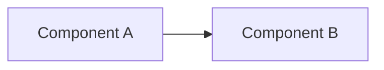
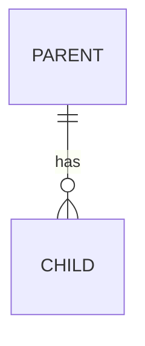

# spec-driven development 統合ワークフロー

現在の状況を自動判定し、適切なフェーズから開発を開始・継続する。

## 後から実装を指示された場合

この skill の承認待ちに入った後で、ユーザーが `$implement` を指定するか、対象と実装内容を明示して実装・続行・完了を指示した場合は、その新しい指示を優先する。未承認の spec を理由に停止せず、`implement` skill に処理を移して実装を続ける。既に承認された内容を同じ理由で再承認させない。

この例外は、上位の instruction、安全上の制約、または新しい指示の範囲を超える変更を許可しない。新しい永続化スキーマ、外部契約、認証フロー、状態の持ち方など、新しい指示に含まれない設計判断が必要になった場合だけ、その判断をユーザーへ求める。

# 状況判定

まず以下の情報を収集し、現在のフェーズを判定せよ：

1. `git branch --show-current` で現在のブランチ名を取得
2. ブランチ名からslugを抽出（slash以降。例: `feat/create-article-component` → `create-article-component`）
3. `.spec/{slug}/spec.md` の存在確認
4. specファイルが存在する場合、タスクの進捗状況を確認する（`- [x]` が完了、`- [ ]` が未完了）

> `.spec/{slug}/spec.html` が存在する場合、それは別のエージェントが HTML 形式で作成した spec である。その場合は新たに `spec.md` を作らず、**既存の `spec.html` をそのまま spec として読み・進捗もその中の `<li class="task todo">` / `<li class="task done">` を書き換えて管理する**（表示は `open .spec/{slug}/spec.html`）。以降の手順の「spec ファイル」はこの `spec.html` を指すものとして読み替える。

## フェーズ判定ルール

| 条件 | フェーズ |
|------|---------|
| main/masterブランチにいる & specなし | **Phase 1: 計画開始** |
| feature branchにいる & specなし | **Phase 1: 計画開始**（ブランチは既存を使う） |
| feature branchにいる & specあり & タスク未着手 | **Phase 2: 実装開始** |
| feature branchにいる & specあり & タスク一部完了 | **Phase 3: 実装再開** |
| feature branchにいる & specあり & タスク全完了 | **Phase 4: 仕上げ** |

判定結果をユーザーに伝えてから、該当フェーズの作業を開始せよ。

> **⚠️ 原則: specファイルが存在しない場合、Phase 1（計画開始）以外のフェーズに進んではならない。まず spec を作成し、ユーザーの承認を得る。上記の「後から実装を指示された場合」に該当するときは、その新しい指示がこの承認待ちを置き換える。**

---

# Phase 1: 計画開始

ユーザーから実行したいタスクの概要を聞き、spec作成から始める。

## ブランチ準備
- タスク概要から適切なslugを考える（例：「記事コンポーネントを作成する」→ `create-article-component`）
- main/masterにいる場合：
  - remoteからpullして同期
  - `git checkout -b {type}/{slug}` でブランチ作成
  - `type` は `feat`, `fix`, `refactor`, `perf`, `style`, `docs`, `test`, `ci`, `build`, `chore`, `revert` から選択
- 既にfeature branchにいる場合：そのブランチをそのまま使う

---

## 設計の記述水準（再現性の基準）— 最重要

> テンプレートはあくまで「枠」に過ぎない。埋め方の水準はこの節が規定し、**この節を満たさない spec は承認に出すことを禁止する。**

specの目的は「方針の共有」ではなく **「実装の再現」** である。合格基準は2つ：

> 1. **このspecファイルだけを渡された別の人・別のエージェントが、設計上の重要判断を自分で下し直すことなく、元の意図と一貫した実装を再現できること。**
> 2. **「基本設計」の章だけを読んだ人が、何をどう変えようとしているかのメンタルモデルを形成できること。**

### specの章構成と、章ごとの責務

spec は次の6章で構成する。**章名も順序も変えない。**

| # | 章 | この章が答える問い |
|---|---|---|
| 1 | 要求事項 | 何を満たせば完成なのか |
| 2 | 基本設計 | 何を、どういう構造で、どう動くものに変えるのか |
| 3 | 設計判断 | 選択肢があった箇所で、何を採り何を却下し、なぜそうしたのか |
| 4 | テスト計画 | 何を検証できれば、設計どおりに動いていると言えるのか |
| 5 | 詳細設計 | 2章の構造を、どの識別子・型・シグネチャ・スキーマで実現するのか |
| 6 | 実装計画 | どのファイルを、どの順で書くのか |

#### 基本設計（2章）と詳細設計（5章）の切り分け

この2章の切り分けが spec の読みやすさを決める。判断に迷ったら **「その記述はコードの形（名前・型・シグネチャ・スキーマ）に依存するか」** で切る。依存するなら詳細設計、依存しないなら基本設計。

| | 基本設計（2章） | 詳細設計（5章） |
|---|---|---|
| 書くもの | 構成要素と責務境界／**データモデルの変更（エンティティ単位）**／状態の持ち方／主要ユースケースの流れ／エージェントのワークフローとハーネス／画面の要件と概要 | 公開シグネチャ（現状 → 変更後）／型定義のフィールド・型・制約／DBスキーマとマイグレーション／API・設定・環境変数・CLIフラグ／処理シーケンスの関数呼び出し順と入出力／エラー型・コードと境界条件 |
| 書かないもの | 関数シグネチャ、カラム定義、enum の値、フィールドの型（すべて5章） | なぜその構造にしたのかの理由（3章）、方針の再説明（2章） |

データモデルは2章と5章の両方で扱う。**2章は「どんなエンティティが増減し、互いにどう関係するか」、5章は「そのエンティティがどのフィールド・型・カラムになるか」** という分担である。2章を読んだ人が扱う実体の数と関係を把握でき、5章を読んだ人がそれをコードに落とせる状態にする。
| 合格基準 | **5章を読まなくても、変更の全体像・状態の流れ・利用者から見た振る舞いが分かる** | 5章だけを渡された実装者が、識別子・型・値を自分で決め直さずに書ける |

#### 基本設計に必ず含める項目

該当がない項目は「なし」と明示する（無言で省略しない）。

- **構成要素と責務境界**: 新規／変更するコンポーネントの一覧と、それぞれが属するレイヤーと担う責務を一文で。関係は図（mermaid）で示す
- **データモデルの変更**: 追加／変更／削除する**エンティティの単位**を、**名前・それが表す実体・他のエンティティとの関係と多重度（1対1／1対多／多対多）・何で一意になるか・どのエンティティに従属し親が消えたらどうなるか** で書く。既存のエンティティを変更する場合は **変更前のモデル → 変更後のモデル** を対比する。関係は図（mermaid の `erDiagram` など）で示す。データモデルに変更がないなら「なし」と明記する（フィールド名・型・カラム定義・制約は5章）
- **状態の持ち方**: この機能が持つ状態を、**どこに置くか（DB／オブジェクトストレージ／リクエスト内の変数など）・誰が書き誰が読むか・どの状態からどの状態へどの条件で遷移するか・いつ消えるか（保持期間）** で書く。状態機械があるなら状態名と遷移条件を列挙する（各値の型やカラム名は5章）
- **主要ユースケースの流れ**: 利用者の操作や外部イベントを起点に、どの構成要素が順に関与して何が起きるかを追える形で。関数名まで下げず「誰が・何を・どういう順で」の粒度で書く
- **エージェントのワークフローとハーネス**（エージェント／LLM を使う機能では必須）:
  - **実行単位の対応**: 1つの指示が何回の実行（ラン）に対応するか、会話・履歴をどう継承するか、何を実行の開始時に渡すか
  - **手順の固定部分と可変部分**: 手順のうち指示によらず不変な順序と、指示によって変わる部分（何を読むか等）を切り分ける
  - **前提条件**: 何を読んでいなければ次へ進めないか。それをプロンプトで促すのか、ツール層で強制するのか
  - **終了条件**: 何をもって1回の実行が終わるか。待機状態を持つか持たないか（持たない場合はその理由を3章へ）
  - **プロンプトの分担**: どのプロンプトが何を担い、実行時に何を差し込むか
  - **ツールの範囲**: できること・できないこと（副作用の有無を含む）と、実行回数・時間・コストの上限
  - **モデルの割り当て**
- **画面の要件と概要**（UIを伴う場合は必須）:
  - **使う人**と、その人が画面で達成したいこと
  - **画面の数・それぞれの役割・遷移**
  - **各画面が取りうる状態をすべて列挙する**（初期・読み込み中・空・進行中・失敗・完了・権限なし など）
  - **文言の方針**（誰に何を伝えるか）と、既存画面・デザインシステムから受ける制約
  - **既存画面に追加する箇所**

#### テスト計画（4章）を詳細設計（5章）より前に置く

テスト計画は「外から観測できる振る舞い」を書く章であり、実装の形に依存しない。要求事項と基本設計から導けるものをここで先に固定する。

- 4章には「**どの振る舞い／境界条件を、どのテストで、どういう入力・状態に対して何を期待して検証するか**」を書く。正常系だけの計画は不可
- 5章「エラーハンドリング / 境界条件」を書いた結果、4章に無い境界条件・エラーケースが出てきたら、**4章に戻して追加する**。5章にだけ書いて済ませてはならない
- 期待するエラー型・コードのような確定形は5章に置き、4章からは「5章の◯◯で定義したエラー」として参照してよい

### 「浅い設計」は最頻の不合格。まずこれを禁止する

次のような記述は **すべて未完成** であり、承認に出してはならない。これは理念ではなく判定基準である：

- 「〜する」「〜を追加する」「〜を適切に処理する」で止まっている（HOW も WHAT も無い方針文）
- 「◯◯系のモジュール/tool/toolset を追加する」のように、**追加する対象の名前・構造・登録方法が書かれていない**
- 「終了アクション（finalize **等**）を導入」のように、**名前すら "等" / "など" で濁している**、または enum 値・フィールド・型が確定していない
- 「実装時に確定する」「あとで決める」「必要に応じて」で **判断を先送りしている**
- 既存コードの変更を「〜を変更する」とだけ書き、**変更前（現状の実在シグネチャ）と変更後の具体形が対比されていない**
- 2章が5章の要約になっている（構造・状態・振る舞いを説明せず、これから書く型やスキーマの名前を並べただけになっている）

これらは「一見詳しそうに見えて、読んだ人が結局すべての判断を自分でやり直す羽目になる」典型である。**ファイル名や既存の識別子を正しく引用していても（＝grounding できていても）、判断が確定していなければ浅い設計だ。** 表・箇条書き・実在パスが並んでいることは、具体化の証拠には一切ならない。

### 具体度の基準（"❌浅い → ✅具体" で示す）

以下の対比が、各項目で要求する粒度である。左（❌）で止まっている記述を見つけたら、右（✅）まで引き上げてから提出する：

- **基本設計 / データモデルの変更**
  - ❌ 「計画テーブルと変更項目テーブルを追加する」
  - ✅ 「エンティティが2つ増える。**計画** ―― 1回の相談のまとまり。テナントに従属し、対象の絞り込み条件と状態を持つ。**変更項目** ―― 計画に従属する1件の変更案で、既存のルールを0〜1件参照する（新規追加の項目はどのルールも参照しない）。計画1件に対し変更項目は0〜N件、計画が破棄されると変更項目も消える。一意性は計画がID単体、変更項目は計画IDとの複合。**既存のルールのモデルは変更しない** ―― 適用時に新しい版を作るだけで、参照は変更項目からルールへの片方向」
- **基本設計 / 状態の持ち方**
  - ❌ 「計画の状態をDBに保持する」
  - ✅ 「計画は永続化され、`open` → `applied` / `discarded` の3状態を取る。状態を書き換えるのは適用処理と破棄処理の2経路のみで、エージェントは変更項目の追加しか行わない。エージェントの会話は計画より長く保たれる必要があるため、保持期間は計画の最終操作からではなく**最初の操作から**数える。会話を失った場合の入口として、現状を読み直すツールを1つ用意する」
- **基本設計 / エージェントのワークフロー**
  - ❌ 「エージェントが指示を受けて変更案を出す」
  - ✅ 「1つの指示が1つのランに対応し、次の指示は前のランの会話を継承した新しいランになる（上限とキャンセルが指示単位になる）。手順は『現状把握 → 意図の分解 → 対象の確定 → 根拠の収集 → 提案 → 返答』の6段で固定し、指示によって変わるのは4段目で何を読むかだけ。3〜5段は意図の数だけ繰り返す。待機状態は持たない ―― 質問は返答として書き、ランを終わらせる」
- **基本設計 / 画面**
  - ❌ 「一覧画面と詳細画面を追加する」
  - ✅ 「3画面。一覧（計画の列挙・状態でフィルタ）、作成（対象の絞り込みと最初の指示）、詳細（変更項目の列と指示の入力欄）。詳細画面が取りうる状態は7つ：初期（項目0件）／エージェント実行中／項目あり・未適用／適用中／適用済み／適用の一部失敗／破棄済み。**すべて描く。** 実行中は入力欄を無効化し、進行の表示は『何をしているか』を文言で示す」
- **詳細設計 / 公開シグネチャ**
  - ❌ 「close 用の tool を sub-agent に配線する」
  - ✅ 「`agent/toolset.go` の `ToolSetResolver` は現状 known ID = `core_ro` / `slack_ro` のみ（`toolset.go:NN`）。ここに ID `case_writer` を追加し、`case__update_case_status(ctx context.Context, caseID string, status CaseStatus) error` を含む `gollem.ToolSet` を返す。`threadcase.buildToolResolver` は `OmitCore: true` を保ったまま、返す集合に `case_writer` を足す」
- **詳細設計 / データモデル・型定義・enum**
  - ❌ 「終了アクションを追加する」
  - ✅ 「`ReplanResult`（`plan.go:NN`）に `Action ReplanAction` を追加。`ReplanAction` は `string` enum で `"investigate" | "question" | "finalize"` の3値。既存の『Tasks も Question も空なら終了』分岐（`plan.go:70`）を削除し、`Action == "finalize"` のときだけ run ループを break する。`Validate()` は3値以外・空を reject」
- **詳細設計 / 処理シーケンス**
  - ❌ 「調査結果を受けて host が materialize する」
  - ✅ 「① `Run[MaterializeResult](ctx, runner, req)` が検証済み `*MaterializeResult{Title string; Description string; Fields map[string]string}` を返す → ② `threadcase.handleMention` がそれを受け `caseRepo.UpdateCase(ctx, caseID, result.Title, result.Description, result.Fields)` を呼ぶ。close は sub-agent の tool call 内で完結するため、この経路には現れない」
- **詳細設計 / 分岐・境界・エラー**
  - ❌ 「失敗は適切に伝播する」
  - ✅ 「sub-agent が panic した場合：`executePhase` で recover し (1) `results[i] = TaskResult{State: Failed, Error: err}` で planner の観測に載せ、(2) `errutil.Handle(ctx, err)` で Sentry に送る。budget 枯渇時は最後の失敗を `FallbackReason` に格納して return」

（上の識別子・行番号は書き方の見本。実際には**あなたが読んだ実コードの実名**に置き換えること。）

### 各セクションが必ず満たす条件

**基本設計（2章）**
- **構成要素と責務境界**: コンポーネントごとの責務を一文で。図で関係を示す
- **データモデルの変更**: エンティティの増減と、関係・多重度・一意性・従属関係まで。既存の変更は 変更前 → 変更後 で対比。変更なしなら「なし」と明示
- **状態の持ち方**: 置き場所・書く主体と読む主体・遷移条件・保持期間まで。「〜の情報を持つ」で止めない
- **主要ユースケースの流れ**: 起点となる操作／イベントごとに、関与する構成要素の順序が追える形で
- **エージェントのワークフローとハーネス**: 上の「基本設計に必ず含める項目」の7点すべて。該当なしなら「エージェントは使わない」と明示
- **画面の要件と概要**: 画面ごとの役割・遷移・**取りうる状態の全列挙**。該当なしなら「UI変更なし」と明示

**設計判断（3章）**
- 選択肢が複数あった箇所（状態の持ち方・同期/非同期・保存先・型の受け渡し方・認証フロー・待機状態を持つか等）は **採用案・却下案・採用理由** を残す（`AGENTS.md`「Design Fidelity」対応）

**テスト計画（4章）**
- 「どの振る舞い／境界条件を、どのテストで、どういう入力・状態に対して何を期待して検証するか」まで。正常系だけは不可

**詳細設計（5章）**
- **公開シグネチャ**: 新規／変更する関数・メソッド・型の **実際のシグネチャ（引数名・型・戻り値・エラー型）**。既存を変更するなら **現状（実在の識別子・行）→ 変更後** を対比する
- **データモデル / 型定義**: **フィールド名・型・意味・制約（必須/任意・値域）** まで。enum は値を確定させる
- **永続化スキーマの変更（DBスキーマ / repository インターフェース / 永続化フォーマット）**: 変更の有無を**必ず判定して明示する**。変更があるなら、テーブル・カラム名／型／NULL可否／デフォルト値／インデックス／制約と repository のメソッドシグネチャを **現状 → 変更後** で対比し、マイグレーション手順・既存データの扱い・後方互換性・ロールバック可否まで書く。変更がないなら「なし」と明記する
- **処理シーケンス**: 主要ユースケースごとに **関数の呼び出し順序** と **各ステップの入出力** が追える形で（2章の流れを、実在の関数名に落としたもの）
- **分岐・境界条件・エラーケース**: 正常系だけでなく異常系・境界値・並行時の振る舞いを列挙し、**返すエラー型/コード** まで書く。ここで出た項目は4章に反映済みであること

### 先送りの全面禁止（逃げ道を塞ぐ）

「あとで決める」「実装時に判断」「必要に応じて」で設計判断を残すことを**禁止する**。設計上の分岐（状態の持ち方・同期/非同期・保存先・型の受け渡し方・命名・enum 値）は spec の中で**決め切る**。

情報が足りず本当に決められない場合、先送りしてはならない——**spec 作成を止めてユーザーに問う**（named な選択肢を提示して選ばせる）。未決のまま承認に出すことは、たとえ「判断基準」を添えても認めない。

### 書きすぎない線引き（ただし逃げ道にしない）

目的は「**実装者が判断を迫られる箇所を、あらかじめ判断済みにしておくこと**」。動くコードの丸写しや、getter・ボイラープレートの列挙は不要。省いてよいのは「**設計が確定していれば機械的に書けるだけのコード本体**」に限る。

⚠️ 「自明だから省く」の判断は厳格に行え。ある識別子の**名前・型・シグネチャ・enum 値・呼び出し順**が spec から一意に読み取れないなら、それは "自明" ではなく **"未確定"** である。「自明」を先送りの言い換えに使うな。

2章と5章で同じことを二度書く必要はない。**同じ事柄を、2章は「構造と振る舞い」として、5章は「確定した形」として書く**という分担であり、重複ではない。

### 根拠を持て（推測で書かない）

既存コードに触れる設計は、`AGENTS.md`「Grounding & Judgment」に従い **実際のコード・スキーマを読んでから** 書く。既存の型・関数・パスに接続する箇所は、**実在する名前で参照する**。まだ読んでいない箇所を「たぶんこうなっている」で書くことは、Honesty Over Plausibility 違反である。

### 承認前の自己監査（必須ゲート）

spec をユーザーに提示する **前に**、次を1項目ずつ点検し、1つでも「いいえ」があれば埋めてから出す。このゲートを通さずに提示することは禁止：

**基本設計（2章）**
- [ ] **2章だけを読んで、何をどう変えるのかのメンタルモデルが形成できるか。** 5章を読まないと全体像が分からない状態になっていないか
- [ ] データモデルの変更が、**エンティティの増減・関係と多重度・一意性・従属関係**まで書かれているか。既存のエンティティを変える場合は 変更前 → 変更後 が対比されているか（変更なしなら明示）
- [ ] 状態の持ち方が、**置き場所・書く主体と読む主体・遷移条件・保持期間**まで書かれているか
- [ ] 主要ユースケースが、構成要素の関与順で追えるか
- [ ] エージェント／LLM を使うなら、**実行単位・固定される手順・前提条件・終了条件・プロンプトの分担・ツールの範囲と上限・モデルの割り当て**が書かれているか（該当なしなら明示）
- [ ] UI を伴うなら、**画面の役割・遷移・取りうる状態のすべて**が列挙されているか（該当なしなら明示）
- [ ] 2章に**シグネチャ・カラム定義・enum の値・フィールドの型が紛れ込んでいないか**（それは5章）

**詳細設計（5章）**
- [ ] 新規／変更する関数・メソッド・型に、**実際のシグネチャ**（引数名・型・戻り値・エラー型）が書かれているか
- [ ] 既存コードを変更する箇所は、**変更前の現状**（実在の識別子・行）と**変更後**が対比されているか
- [ ] 主要データ構造に、**フィールド名・型・意味・制約**が書かれているか
- [ ] 主要ユースケースが、**関数の呼び出し順と各ステップの入出力**で追えるか
- [ ] enum / 定数 / 識別子の **値が確定** しているか（"等" / "など" で濁していないか）
- [ ] **永続化スキーマ（DBスキーマ・repository インターフェース・永続化フォーマット）の変更有無を明示したか。** 変更があるなら 現状 → 変更後 の対比・マイグレーション手順・既存データの扱い・後方互換性・ロールバック可否まで書けているか。変更がないなら「なし」と書いてあるか
- [ ] 既存コードに接続する名前が、推測でなく **実在を確認済み** か

**全体**
- [ ] 3章に、選択肢のあった箇所の **採用案・却下案・採用理由** が書かれているか
- [ ] 4章が、5章「エラーハンドリング / 境界条件」で列挙した項目を**すべて覆っている**か
- [ ] 「実装時に確定」「あとで決める」「必要に応じて」等の **先送り表現が残っていないか**

---

## 統合specファイルの作成

specは **Markdown** で作成し、`mo` コマンドでブラウザに表示してレビューに供する。

- `.spec/{slug}/` ディレクトリを作成
- specの実体は **`.spec/{slug}/spec.md`** に配置する
- 本文は日本語で記述する
- **図は mermaid のコードブロックで表現してよい**（`mo` は mermaid を描画できる）。ASCII Art は使わない
- **進捗チェックボックスは GitHub 互換の `- [ ]`（未完了） / `- [x]`（完了）で表現する。** 実装時はこの `[ ]` ↔ `[x]` を書き換えて進捗を管理する（grepしやすく編集も容易）

以下のテンプレートを `.spec/{slug}/spec.md` の出発点とする（`{タスク名}` 等のプレースホルダは埋める）:

````markdown
# {タスク名} Specification

## 1. 要求事項 (Requirements)

### 概要
[タスクの概要と目的]

### 機能要件
- [要件1]
- [要件2]

### 非機能要件
- [パフォーマンス要件]
- [セキュリティ要件]

### 制約事項
- [技術的制約]
- [ビジネス制約]

## 2. 基本設計 (High-Level Design)

> この章の合格基準は「**この章だけを読んだ人が、何をどう変えようとしているかのメンタルモデルを形成できること**」。構造・状態・振る舞いを書く章であり、シグネチャ・カラム定義・enum の値・フィールドの型は書かない（それは「5. 詳細設計」）。該当がない項目は「なし」と明示する。

### 構成要素と責務境界
[新規/変更するコンポーネントの一覧。それぞれが属するレイヤーと担う責務を一文で]



### データモデルの変更

> 扱う実体が何件増減し、互いにどう関係するかを書く。フィールド名・型・カラム定義・制約は「5. 詳細設計」。変更がないなら「なし」と明記する。

- **[エンティティ名]**（新規 / 変更 / 削除）— [それが表す実体を一文で] / 関係: [どのエンティティと1対1・1対多・多対多のいずれで結ばれるか] / 一意性: [何で一意になるか] / 従属: [どのエンティティに従属し、親が消えたらどうなるか]

[既存のエンティティを変更する場合は *変更前のモデル → 変更後のモデル* を対比する。変更しない既存エンティティにも影響が及ぶなら、その影響を明記する]



### 状態の持ち方
- **置き場所**: [DB / オブジェクトストレージ / リクエスト内の変数 など。永続化するかしないか]
- **書く主体 / 読む主体**: [誰がこの状態を書き換えられるか。読むのは誰か]
- **状態と遷移**: [状態名の列挙と、どの状態からどの状態へ、どの条件で遷移するか]
- **保持期間**: [いつ消えるか。何を基準に数えるか]

### 主要ユースケースの流れ
[利用者の操作や外部イベントを起点に、どの構成要素が順に関与して何が起きるかを追える形で。関数名まで下げず「誰が・何を・どういう順で」の粒度で。ユースケースごとに小見出しを立てる]

### エージェントのワークフローとハーネス

> エージェント / LLM を使う機能では必須。使わないなら「エージェントは使わない」と明示する。

- **実行単位の対応**: [1つの指示が何回の実行に対応するか。会話・履歴の継承方法。実行の開始時に何を渡すか]
- **手順の固定部分と可変部分**: [指示によらず不変な手順の順序と、指示によって変わる部分]
- **前提条件**: [何を読んでいなければ次へ進めないか。プロンプトで促すのか、ツール層で強制するのか]
- **終了条件**: [何をもって1回の実行が終わるか。待機状態を持つか持たないか]
- **プロンプトの分担**: [どのプロンプトが何を担い、実行時に何を差し込むか]
- **ツールの範囲**: [できること・できないこと。副作用の有無。実行回数・時間・コストの上限]
- **モデルの割り当て**: [どの処理にどのモデルを使うか]

### 画面の要件と概要

> UIを伴う場合は必須。伴わないなら「UI変更なし」と明示する。

- **使う人**: [誰が、何を達成するために使うか]
- **画面の構成**: [画面の数・それぞれの役割・遷移]
- **取りうる状態**: [画面ごとに、初期・読み込み中・空・進行中・失敗・完了・権限なし など**すべて**列挙する]
- **文言の方針**: [誰に何を伝えるか]
- **既存への制約 / 追加箇所**: [既存画面・デザインシステムから受ける制約。既存画面に追加する箇所]

## 3. 設計判断 (Design Decisions)

> 選択肢が複数あった箇所（状態の持ち方・同期/非同期・保存先・型の受け渡し方・認証フロー・待機状態を持つか等）を、実装者が蒸し返さないために残す。なければ「特筆すべき分岐なし」と明示。

- **[論点]** — 採用: [採用案] / 却下: [却下案] / 理由: [なぜ採用案を採ったか]

## 4. テスト計画 (Test Plan)

> 外から観測できる振る舞いを書く章。「どの振る舞い/境界条件を、どのテストで、どういう入力・状態に対して何を期待して検証するか」まで具体的に書く。正常系だけのテスト計画は不可。「5. 詳細設計」の境界条件を書いた結果ここに無いケースが出たら、この章に戻して追加する。

- [ ] 正常系ユニットテスト（対象 → 入力/状態 → 期待する結果）
- [ ] 境界値・異常系ユニットテスト（ケース → 入力/状態 → 期待するエラー型/コード・戻り値）
- [ ] 統合テスト（対象の経路 → 入力/状態 → 期待する結果）

## 5. 詳細設計 (Detailed Design)

> 「2. 基本設計」の構造を、コードに落ちる確定形で書く章。合格基準は「この章だけを渡された実装者が、識別子・型・値を自分で決め直さずに書けること」。該当がない項目は「なし」と明示する。

### 公開シグネチャ
[新規/変更する関数・メソッド・型の実際のシグネチャ。引数名・型・戻り値・エラー型まで。既存を変更するなら *現状のシグネチャ（実在の識別子・行）→ 変更後のシグネチャ* を併記。例: `func (s *Service) Foo(ctx context.Context, id ID) (*Result, error)`]

### データモデル / 型定義
[「2. 基本設計 → データモデルの変更」で挙げたエンティティを、フィールド名・型・意味・制約（必須/任意・値域）まで落とす。enum は値を確定させる。エンティティに現れない補助的な型もここに書く]

### データスキーマ / マイグレーション

> **変更がある場合は必ず明示。変更がないと判断した場合も「なし」と明記する。**

- **DBスキーマ**: 追加・変更・削除するテーブル／カラムを、名前・型・NULL可否・デフォルト値・インデックス・制約（PK/FK/UNIQUE）まで *現状 → 変更後* で対比
- **repository インターフェース**: 永続化層のメソッドシグネチャの追加・変更・削除を *現状 → 変更後* で対比
- **マイグレーション**: 適用手順、既存データの扱い（バックフィル／変換／削除）、後方互換性（旧コードは新スキーマを読めるか・その逆はどうか）、ロールバック可否と失敗時の復旧手段
- **その他の永続化フォーマット**: メッセージフォーマット、ファイル・オブジェクトストレージの保存形式、キャッシュのキー設計など

### 外的インターフェース (External Interfaces)

> 外部から観測・利用される境界は、後から変更すると影響範囲が大きいため、設計段階で具体的に確定させる。以下のうち該当するものはすべて、名前・型・デフォルト値・必須/任意・後方互換性への影響まで明記する。該当がない項目は「なし」と明示する。

- **API / エンドポイント**: 追加・変更するエンドポイント、リクエスト/レスポンスのスキーマ、ステータスコード、認証方式
- **設定 (Configuration)**: 追加・変更する設定項目、設定ファイルのキー、デフォルト値、許容値の範囲
- **環境変数 (Environment Variables)**: 追加・変更・削除する環境変数名、用途、デフォルト値、必須かどうか
- **CLIフラグ・引数**: 追加・変更するコマンドラインフラグ、引数、サブコマンド
- **外部連携 / 権限**: 外部サービス連携、必要なOAuthスコープ・IAM権限、Webhook など

### 処理シーケンス
[「2. 基本設計」の主要ユースケースの流れを、実在の関数/メソッド名に落としたもの。呼び出し順序と各ステップの入出力が追える形で。必要なら sequence 図（mermaid）]

### エラーハンドリング / 境界条件
[「どういう入力/状態のときに何が起きるか」を具体的に列挙。異常系・境界値・並行時の振る舞い、返すエラー型/コードまで。**ここで列挙した項目は「4. テスト計画」に反映済みであること**]

### UI / その他のインターフェース
[コンポーネント構成、状態管理の実体、上記に当てはまらないインターフェース仕様。「2. 基本設計」の画面要件を実装可能な形に落としたもの]

## 6. 実装計画 (Implementation Plan)

### 影響を受けるファイル
新規作成:
- [ ] `path/to/new-file1.ext`
- [ ] `path/to/new-file2.ext`

修正:
- [ ] `path/to/existing-file1.ext`

削除:
- [ ] `path/to/delete-file.ext`

### 実装ステップ

> PRを分割する場合は、PRごとに小見出しを立て、含める変更と依存する先行PRを書く。

- [ ] **Step 1**: [ステップの説明]（詳細な作業内容 / 影響するファイル）
- [ ] **Step 2**: [ステップの説明]（詳細な作業内容 / 影響するファイル）
- [ ] **Step 3**: [ステップの説明]（詳細な作業内容 / 影響するファイル）

### リリース準備
- [ ] ドキュメントの更新（特に「外的インターフェース」の変更点 — API・設定・環境変数など — を反映する）
- [ ] マイグレーション（必要な場合）
````

---

## spec作成後の必須手順

> **⚠️ 重要: 以下の手順を必ず順に実行せよ。省略は禁止。**

0. **自己監査（必須ゲート）**: ブラウザに表示する前に、上の「設計の記述水準 → 承認前の自己監査（必須ゲート）」チェックリストを1項目ずつ通す。1つでも未達があれば **表示・レビュー依頼に進まず、spec を直してから** 次へ進む。特に「2章だけでメンタルモデルが形成できるか」と、「浅い設計」の禁止項目（"等"での濁し・先送り表現・変更前後の対比欠落・シグネチャ欠落）が残っていないかを最後に見る。
1. **ブラウザに表示する（必須）**: `mo .spec/{slug}/spec.md` を実行してブラウザに表示する。`mo` はファイルを監視して再表示するため、spec を修正しても再実行は不要（必要に応じてユーザーに再読み込みを促す）。
2. **ユーザーにレビューを依頼し、ここで停止する（必須）**: specを提示した状態でレビューを依頼し、ユーザーから明示的な承認を得るまで Phase 2 に進まない。ただし、その後に `$implement` または対象と実装内容を明示した実装・続行・完了の指示を受けた場合は、その指示を承認として扱い、停止せず実装へ進む。

---

# Phase 2: 実装開始

specファイルに基づいて実装を開始する。

## コンテキストの整理
- **コンテキストが実際に逼迫している場合に限り**、実装開始前に `/compact` を実行して圧縮する。Phase 1での議論やspec作成過程の詳細はspecファイルに集約されているため、圧縮しても実装に必要な情報は失われない
- 逼迫していないなら圧縮しない。Phase 1 の議論には spec に書き切れなかった文脈（却下案の温度感、ユーザーの意図）が残っており、実装中の判断に効く。予防的な圧縮はそれを捨てるだけになる

## specの読み込み
- ファイルパスが引数で与えられた場合はそのパス、なければブランチ名のslugから `.spec/{slug}/spec.md` をspecとして読み込む
- specの全6章（要求事項・基本設計・設計判断・テスト計画・詳細設計・実装計画）を把握してから実装に着手する。**基本設計で全体像を掴んでから詳細設計を読む**

## 調査・リサーチ
- 実装中にライブラリのAPIやフレームワークの仕様を確認する必要がある場合、Web検索が有効なら公式ドキュメントを参照せよ
- 不明な仕様や使い方があれば、推測で実装せず調べてから進める。Web検索が使えず確認できない場合は、推測で書かずユーザーに確認する

## 実装の進め方
- 実装計画のステップに沿って順に進める
- 完了した作業や編集が終わったファイルは、対応するチェックボックス（`- [ ]` → `- [x]`）を書き換えて進捗を記録しながら進める（最後にまとめてではなく、都度実施）
- 進捗を更新すると同時にspecの内容を見直し、実装すべき内容や方向性を確認する
- spec を書き換えても `mo` がファイルを監視・自動更新するため、再実行は不要
- 実装中に追加の指示があった場合は specファイル（`spec.md`）も更新する
- **spec に書かれていない永続化スキーマの変更（DBスキーマ・repository インターフェース・永続化フォーマット）が必要になったら、黙って実装せず、その場でユーザーに変更内容（現状 → 変更後・既存データへの影響）を伝えて判断を仰ぐ。** 合意が取れたら spec の「5. 詳細設計 → データスキーマ / マイグレーション」に反映してから実装する
- **基本設計に書かれた構造（状態の持ち方・責務境界・エージェントの手順や上限・画面の状態）を変える必要が出た場合も、黙って変更せずユーザーに判断を仰ぐ。** 合意が取れたら「2. 基本設計」と、必要なら「3. 設計判断」に反映してから実装する
- 実装に支障をきたす問題が発生しない限り、最後まで完了させよ。途中で止まるな
- `// TODO` や `// FIXME`、仮実装、スタブなどを残すな。すべての機能を完全に実装し切ること

## git add
- ファイルを変更・作成したら都度 `git add` せよ。実装完了時にまとめてではなく、変更のたびに実施する
- **`git add .` や `git add -A` のような一括追加は禁止。** 必ず `git add <ファイルパス>` で対象ファイルを明示的に指定すること
- **specファイル（`.spec/` 以下）は `git add` するな。** specはあくまで作業用ドキュメントであり、コミット対象に含めない

---

# Phase 3: 実装再開

途中まで進んでいる実装を継続する。

- specファイル（`spec.md`）を読み込み、チェックボックスの状態（`- [ ]` / `- [x]`）から進捗を把握する
- 未完了のステップの最初から実装を再開する
- Phase 2と同じルールに従って進める

---

# Phase 4: 仕上げ

実装計画のタスク（`- [ ]` / `- [x]`）がすべて完了になっている状態。

- specを最終確認し、漏れがないか点検する
- 「4. テスト計画」に基づいてテストが通ることを確認する
- ユーザーに完了報告する
